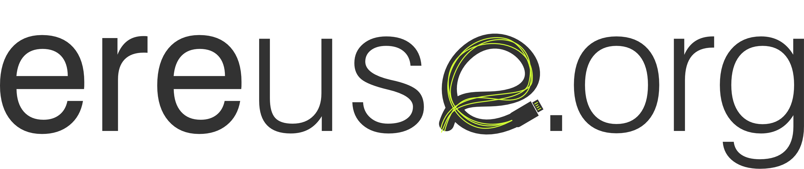

# Introduction

## Abstract

A circular economy is about capturing value lost in traditional linear systems. This implies transforming the linear supply chain into loops that retain more value. It goes beyond recycling, involving repair, refurbishment and reuse of products where more of the original value is captured with reduced environmental impact. Circular economies are particularly relevant for digital devices or electric and electronic equipment \(EEE\). Built using scarce and potentially toxic materials and subject to informal recycling in the developed and developing world, these devices have become a global environmental problem. We focus on refurbished used devices such as computers, laptops or mobiles. After repair and testing by authorized agents, refurbished products go back to the supply chain, helping to reduce e-waste. eReuse.org involves several local organizations managing thousands of devices for reuse. The eReuse.org community has developed an understanding of the problem, the challenges to move to a circular economy, the value of an ecology for digital devices, where circularity critically depends on the traceability of devices and cooperation among all stakeholders locally and globally. Our vision is a resource-efficient circular economy for digital devices, a collective effort in a collaborative community, for a sustainable market from an economic and ecologic perspective. This community relies on processes, software tools, web services and big open data for efficient, trustworthy and transparent circular exchanges with citizens \(B2C\), private \(B2B\) and public administration \(B2A\) entities. Pangea proposes to develop the use case of a “Circular Economy” of “slow moving” circular goods \(SMCG\), based on an the integration of the eReuse.org community with the use of SmartTags and the TIS ecosystem where stakeholders exchange certified data about the status, value and traceability of digital devices, and perform a pilot project about circular economy in a real business environment. Free Keywords: Circular Economy, Digital Devices, Reuse, Traceability, Cooperation, Communities, Standardisation, Optimization.

## Company description

Pangea is a private, independent non-profit organization founded in 1993 to promote the strategic use of Information and Communication Technologies \(ICT\) for development and social justice, and to become a tool to help meet the objectives of social groups, organizations and social movements in the local context. Pangea is focused in promoting among social movements and organizations the values of sharing information, knowledge and technical resources for an effective and strategic use of ICTs, especially the Internet, in a sustainable and environmentally-friendly way that respects and values diversity of culture and local and global society. Pangea has about 200 individual and some 350 member entities \(e.g. associations, schools, groups, foundations\). Member of the international network APC \(Association for Progressive Communications\) participates in global initiatives about ICT, with IT sustainability as one of the strategic priorities of the organization, with 8 member organizations in Europe, and 58 around the world in 78 countries.

## Profile and expertise

Pangea has expertise in ICT services for individuals and organisations, mainly on the area of support, training, project management, software development, hosting, operation of Internet services and legal aspects of ICT services. Pangea has experience in local, national and international activities, services, training, technical support, and studies on the impact of ICTs in society. It has been operating its own Internet service platform since 1993. In has participated in 5+ EU funded projects since 1995, the most recent a FP7 research project, and therefore we have experience and capacity for the management and administration to run the project. Pangea has been involved in promoting socio-environmentally responsible consumption of digital equipment since 2010. Pangea coordinates the Electronic Reuse \(eReuse.org\) community since 2015 that develop, share and operates open-source services for the circular economy of electronics, that involves several other local organizations, most of them social enterprises in the area of circular economy. Pangea is a **platform provider** \(Devicetag.io\) using eReuse software tools as a service. The team that will work in SmartTagIT is already employed part time by Pangea or is working as freelancer in the eReuse project., that are also contributing to eReuse. The European and global dimension of eReuse is supported by Pangea belonging to APC and collaborating with the European RReuse, Zero Waste Europe and Electronics Watch organizations.

